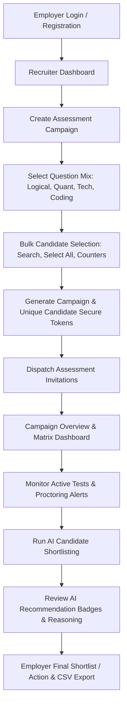
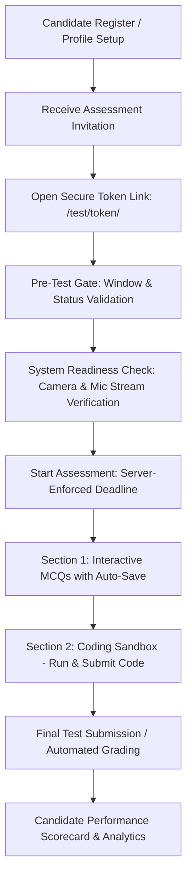
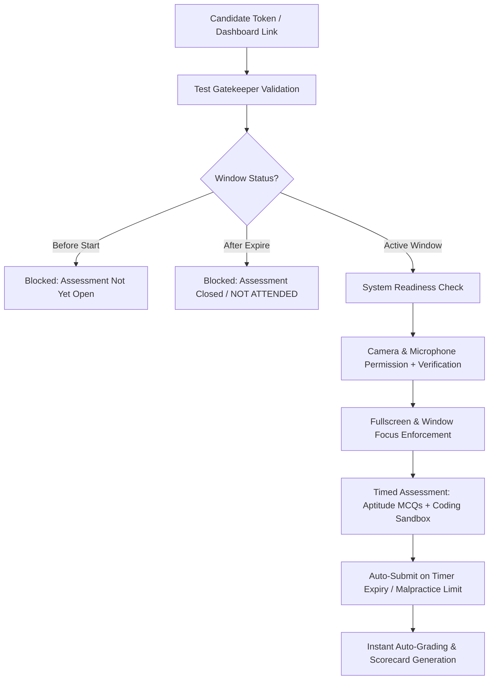

# Interview Trainer — Automated Technical Hiring & Assessment Platform

> **An enterprise-grade, full-stack recruitment platform featuring bulk candidate assessment campaigns, live proctored test sessions, sandboxed algorithmic coding execution, AI-assisted shortlisting, and real-time performance analytics.**

---

## 🌐 Live Website & Links

- **Repository**: [https://github.com/DevByD/interview-trainer-django](https://github.com/DevByD/interview-trainer-django)
- **Local Development URL**: [http://localhost:8000](http://localhost:8000)
- **Production Host**: [http://manya.apolloaitech.co:12700](http://manya.apolloaitech.co:12700) *(configured via CI/CD deployment)*
- **Live Website**: https://interview.humandb.co/

---

## ⭐ Key Features

- **👥 1-to-Many Bulk Assessment Campaigns**: Configure an assessment once with custom aptitude counts, coding challenges, and schedule windows, then batch-assign across multiple candidates with unique secure access tokens.
- **🛡️ Multi-Layered Client & Server Proctoring**: Hardware camera/microphone stream validation, full-screen enforcement, tab-switch/window-blur tracking, devtools shortcut blocking, and auto-submission upon reaching violation limits.
- **💻 Sandboxed Coding Assessment**: Interactive code editor supporting Python 3 (plus optional JavaScript, Java, and C++ environments) running against sample and hidden test cases inside isolated subprocesses with stripped secrets and resource limits.
- **🤖 AI-Assisted Question Generation & Shortlisting**: Automated question synthesis with Google Gemini API (with deterministic algorithmic fallback), plus ethical, transparent candidate shortlisting recommendations with data-backed reasoning.
- **📊 Comprehensive Analytics & CSV Export**: Real-time candidate evaluation dashboards, section-level scorecards (Logical, Quantitative, Technical, Coding), interactive Chart.js visualizations, and multi-tenant isolated CSV export.
- **📱 Fully Responsive Design**: Mobile-first interface designed to display consistently from 375px smartphones to 1440px+ ultra-wide displays without horizontal overflow.
- **🧪 Production-Ready Test Coverage**: 105 automated tests (88 Django unit/integration tests and 17 Playwright browser E2E tests) passing with 100% reliability.

---

## 🏢 Employer Workflow



1. **Dashboard & Candidate Directory**: Browse all registered candidates, filter by skill set, education, and years of experience.
2. **Assessment Campaign Setup**: Define time windows, test duration, MCQ section distribution (Logical Reasoning, Quantitative Aptitude, Technical Aptitude), and choose whether to attach coding problems.
3. **Bulk Candidate Selection**: Search candidates with instant filtering, use "Select All" / "Deselect All", observe live selection count badges, and assign the cohort in one action.
4. **Campaign Matrix Dashboard**: View aggregate metrics (Assigned, Completed, In Progress, Not Started, Shortlisted) and filter candidates by status or malpractice flag.
5. **AI Shortlisting Decision Support**: Trigger AI candidate shortlisting across completed assessments to generate advisory classifications (`Strong Match`, `Review Recommended`, `Low Match`).
6. **Recruiter Autonomy**: Shortlist or remove candidates with instant AJAX toggles, add evaluation notes, and export comprehensive CSV score sheets.

---

## 👨‍🎓 Candidate Workflow



1. **Onboarding & Profile**: Register account, update education, skills, and upload resume files (`.pdf`, `.doc`, `.docx` with mime-type and extension validation).
2. **Accessing Assessments**: Access assigned assessments via the Candidate Dashboard or directly through high-entropy cryptographic links (`/test/<token>/`).
3. **System Readiness Checklist**: Candidate browser verifies actual video and audio streams from hardware devices before unlocking the test.
4. **Timed Assessment Execution**: Answer multiple-choice questions using an interactive question palette with real-time AJAX auto-saving and countdown warnings.
5. **Algorithmic Coding Sandbox**: Solve programming problems with starter scaffolds, execute code against sample test cases in real-time, and submit for grading against hidden test suites.
6. **Scorecard & Feedback**: Review section-by-section breakdown, percentage scores, and graphical skill distributions upon test completion.

---

## 🤖 AI Features

### 1. Dynamic Question Generation
- **Google Gemini Integration**: Dynamically generates unique, high-quality assessment questions across Logical, Quantitative, and Technical domains via Gemini REST API.
- **Algorithmic Fallback**: When API keys are not supplied or network connectivity is unavailable, an algorithmic question bank generator automatically produces curated algorithmic questions.
- **JSON Sanitizer**: Strict JSON parser extracts valid question schemas, strips markdown formatting, and validates answer options.

### 2. AI-Assisted Candidate Shortlisting (Decision Support)
- **Data-Driven Evaluation**: Evaluates completed candidate assessments using legitimate metrics:
  - Overall weighted score
  - Section breakdown (Aptitude vs. Coding)
  - Algorithmic problem test case pass rates (Sample and Hidden)
  - Proctoring violation counts and malpractice terminations
- **Three-Tier Advisory Classification**:
  - `⭐ STRONG MATCH`: High score ($\ge 75\%$), clean proctoring, excellent coding test case pass rate.
  - `📋 REVIEW RECOMMENDED`: Moderate score ($\ge 50\%$) or strong performance in specific sub-domains with minor warnings.
  - `⚠️ LOW MATCH`: Score below baseline thresholds or auto-submitted for excessive malpractice violations.
- **Transparent Rationale**: Every recommendation provides a concise, 2-to-4 sentence rationale explaining the exact data points behind the evaluation.

> [!IMPORTANT]
> **Ethical AI & Non-Autonomous Decision Policy**:
> AI recommendations serve strictly as advisory decision-support signals. The system never makes autonomous hiring or rejection decisions. Final shortlisting decisions remain exclusively with the human employer. No demographic or protected characteristics are ever inferred or evaluated.

---

## 🛡️ Proctoring & Integrity Verification

The platform implements multi-stage proctoring to protect assessment integrity while respecting candidate privacy:

- **Hardware Camera & Microphone Verification**: Prior to taking the test, the browser requests media permissions and verifies that active media tracks are delivering real streams.
- **Full-Screen Enforcement**: The test interface monitors full-screen state transitions and flags exits.
- **Tab-Switch & Blur Tracking**: Detects browser tab switches and window blur events using the HTML5 Page Visibility API and `window.onblur`.
- **Developer Tools & Shortcut Interception**: Blocks common browser inspection shortcuts (`F12`, `Ctrl+Shift+I`, `Ctrl+Shift+J`, `Ctrl+U`, `Ctrl+C`, `Ctrl+V`).
- **Violation Logging & Warning Counter**: Displays non-intrusive modal alerts warning candidates upon detecting suspicious events.
- **Automated Malpractice Submission**: If a candidate exceeds the maximum configured violation threshold (default: 3 violations), the assessment is immediately locked, marked as `MALPRACTICE_FLAGGED`, and auto-submitted with violation logs.
- **Zero Answer Key Exposure**: Question answer keys and hidden evaluation test cases are never rendered in HTML templates, data attributes, or client-side JavaScript payloads.

> [!NOTE]
> *Disclaimer: While these measures detect and discourage common unpermitted behaviors, no web-based proctoring system can guarantee 100% prevention of all forms of cheating.*

---

## 💻 Sandboxed Coding Assessment

```text
+-------------------------------------------------------------------------+
| [Python 3]  Find Maximum Element in Array              Time Limit: 3.0s |
+-------------------------------------------------------------------------+
| 1 | def find_max(arr):                                                 |
| 2 |     if not arr:                                                     |
| 3 |         return None                                                 |
| 4 |     return max(arr)                                                 |
+-------------------------------------------------------------------------+
| [ ▶ Run Code (Sample Cases) ]              [ 🚀 Submit Final Code ]     |
+-------------------------------------------------------------------------+
| Execution Output:                                                       |
| Test Case #1 (Sample): Input: [3, 8, 1, 9, 2] -> Expected: 9 [PASSED]   |
| Test Case #2 (Hidden): [PASSED] (Execution time: 42ms)                  |
| Summary: 2/2 Test Cases Passed (100.0%)                                 |
+-------------------------------------------------------------------------+
```

### Execution Engine Architecture
- **Process Isolation**: Code runs inside ephemeral temporary workspaces (`tempfile.TemporaryDirectory`) that are created and destroyed for every execution run.
- **Environment Sanitization**: All parent environment variables containing sensitive secrets (`SECRET_KEY`, `DATABASE_URL`, `GEMINI_API_KEY`, email credentials) are stripped before spawning subprocesses.
- **Execution Limits**:
  - **Per-testcase Timeout**: Hard 3.0-second limit per test case to terminate infinite loops.
  - **Buffer Cap**: Output truncated to 4KB to prevent memory or log bombing.
  - **Syntax Validation**: Source code pre-validated (e.g. Python AST parser) before subprocess invocation.
- **Multi-Language Architecture**: Built with a modular base executor supporting:
  - **Python 3** (native environment)
  - **JavaScript** (via Node.js runtime if installed)
  - **Java** (via `javac`/`java` if installed)
  - **C++** (via `g++`/`clang++` if installed)
- **Dual Test Case Evaluation**: Candidates can test against visible sample test cases with full stdout/stderr visibility, while final submission evaluates against masked hidden test cases.

---

## 👥 Bulk Candidate Assignment

- **Single Campaign Creation**: Recruiters configure test parameters, aptitude counts, and coding questions once.
- **Candidate Selection UX**:
  - Real-time client-side search across candidate names, emails, and skill sets.
  - **Select All** / **Deselect All** / **Clear Selection** controls.
  - Live visual counter badge (`#selectedCountBadge`) updating instantly upon selection.
- **Duplicate Assignment Protection**: Database-level unique constraint (`unique_candidate_per_assessment_group`) prevents assigning the same candidate multiple times within a campaign.
- **Individual Access Tokens**: Every assigned candidate receives an independent `Assessment` record with a unique cryptographic URL token (`/test/<token>/`).
- **Campaign Dashboard**: Dedicated campaign matrix view aggregating cohort statistics and tracking candidate progress from `NOT_STARTED` to `COMPLETED`.

---

## 📊 Analytics & Reporting

- **Section Breakdown**: Granular scoring across Logical Reasoning, Quantitative Aptitude, Technical Aptitude, and Algorithmic Coding.
- **Interactive Visualizations**: Dynamic Chart.js doughnut charts visualizing domain strength distributions and performance tiers.
- **Proctoring Logs**: Recruiter view of recorded violation timestamps, violation types, and submission reasons.
- **CSV Data Export**: One-click download of candidate evaluation reports with multi-tenant security filters (`employer=request.user`) ensuring complete tenant data isolation.

---

## 🎓 Candidate Workflow



---

## 🧪 Comprehensive Automated Testing & QA

The repository includes a battle-tested automated test suite consisting of **88 Django Unit & Integration Tests** and **18 Playwright End-to-End Browser Tests**, verifying all authentication, proctoring, coding evaluation, date/time scheduling windows, AI generation, and bulk candidate workflows.

### Current Test Verification Status

```
======================================================================
DJANGO UNIT & INTEGRATION TESTS: 88 / 88 PASSED (100%)
Ran 88 tests in ~242s — OK

PLAYWRIGHT E2E BROWSER TESTS: 18 / 18 PASSED (100%)
================== 18 passed in ~85s ==================
======================================================================
TOTAL AUTOMATED TESTS: 106 / 106 PASSING (100%)
```

### 1. Django Unit & Integration Tests (88 Tests)
- [`accounts/tests.py`](file:///C:/Users/intel/interview-trainer/accounts/tests.py) (10 Tests): Authentication, dual registration, role enforcement, profile updates, resume upload.
- [`candidates/tests.py`](file:///C:/Users/intel/interview-trainer/candidates/tests.py) (8 Tests): File upload security, binary rejection, custom error handlers (400, 403, 404, 500), cron secret authentication, rate limiting.
- [`results/tests.py`](file:///C:/Users/intel/interview-trainer/results/tests.py) (8 Tests): Employer results views, status filtering, candidate search, CSV export, multi-tenant security isolation.
- [`assessments/tests.py`](file:///C:/Users/intel/interview-trainer/assessments/tests.py) (62 Tests):
  - Phase 2 Assessment Engine (17 tests)
  - Proctoring & Malpractice Violations (7 tests)
  - Question Bank & Difficulty Engine (5 tests)
  - AI Question Generation & Sanitization (12 tests)
  - Subprocess Code Execution & Evaluation (6 tests)
  - Bulk Candidate Assignment & AI Shortlisting (5 tests)
  - Date-Time Scheduling & Window Boundary Tests (10 tests: before start, at start, after start, at end, after end, AM, PM, 12:00 AM midnight, 12:00 PM noon)

### 2. Playwright End-to-End Tests (18 Tests)
- [`tests/e2e/test_assessment_flow.py`](file:///C:/Users/intel/interview-trainer/tests/e2e/test_assessment_flow.py) (2 Tests):
  - Full candidate MCQ assessment journey from token access to results.
  - Complete schedule window lifecycle: Employer creates assessment with AM/PM schedule $\rightarrow$ bulk assigns candidates $\rightarrow$ candidate blocked before start $\rightarrow$ opens at scheduled time $\rightarrow$ candidate can start $\rightarrow$ candidate remains able to start after scheduled start $\rightarrow$ assessment closes at end time.
- [`tests/e2e/test_bulk_assignment_and_shortlisting.py`](file:///C:/Users/intel/interview-trainer/tests/e2e/test_bulk_assignment_and_shortlisting.py) (3 Tests): Bulk candidate assignment flow, AI shortlisting execution, and mobile responsiveness.
- [`tests/e2e/test_coding_flow.py`](file:///C:/Users/intel/interview-trainer/tests/e2e/test_coding_flow.py) (1 Test): Interactive code editor, sample run, and final submission evaluation.
- [`tests/e2e/test_employer_navbar_and_responsive.py`](file:///C:/Users/intel/interview-trainer/tests/e2e/test_employer_navbar_and_responsive.py) (10 Tests): Desktop and mobile navigation bars, recruiter dropdowns, and responsive layout across 375px–1440px viewports.
- [`tests/e2e/test_proctoring_and_malpractice.py`](file:///C:/Users/intel/interview-trainer/tests/e2e/test_proctoring_and_malpractice.py) (2 Tests): Real vs denied media stream validation and tab-switching malpractice auto-submission.

### Test Execution Commands

```powershell
# Run all Playwright E2E browser tests (18 tests)
.\venv\Scripts\pytest.exe -v

# Run all Django unit & integration tests (88 tests)
.\venv\Scripts\python.exe manage.py test

# Run a specific test app
.\venv\Scripts\python.exe manage.py test assessments

# Run a specific E2E test file
.\venv\Scripts\pytest.exe tests/e2e/test_bulk_assignment_and_shortlisting.py -v
```

---

## 🛠️ Technology Stack

- **Backend**: Python 3.12, Django 6.1 (with `django.contrib.auth`, Django ORM)
- **Database**: SQLite 3 (local development & testing) / MySQL 8.0 (production-ready via `PyMySQL`)
- **Frontend**: HTML5, Modern CSS3 (CSS Variables, Flexbox, CSS Grid), Vanilla JavaScript (ES6+)
- **Data Visualization**: Chart.js 4.x
- **Code Execution**: Python Subprocess Sandbox (`tempfile.TemporaryDirectory`, AST parsing)
- **AI Integration**: Google Gemini 1.5/2.5 API (REST via `urllib.request` / JSON parsing)
- **Static Files & Media**: WhiteNoise 6.6, Pillow 10.0
- **Testing & E2E**: Playwright (Chromium), Pytest 9.1, `pytest-django` 4.14
- **CI/CD & Deployment**: GitHub Actions, Vercel Serverless (`vercel.json`), PM2 Process Manager

---

## 📁 Project Structure

```text
interview-trainer/
├── .github/
│   └── workflows/
│       ├── ci.yaml                      # CI pipeline: lint, system check, Django tests, Playwright E2E
│       └── deploy.yaml                  # Production CD deployment workflow
├── accounts/                            # User authentication & profiles app
│   ├── models.py                        # CandidateProfile, EmployerProfile
│   ├── views.py                         # Registration, login, logout
│   ├── forms.py                         # Auth & profile forms
│   ├── decorators.py                    # Role-based access control decorators
│   └── tests.py                         # Authentication test suite
├── assessments/                         # Core assessment engine app
│   ├── models.py                        # Assessment, AssessmentGroup, Question, CodingQuestion, etc.
│   ├── views.py                         # Assessment creation, exam taker, campaign dashboard, shortlisting
│   ├── forms.py                         # Assessment creation form (single & bulk candidate support)
│   ├── code_executor.py                 # Sandboxed subprocess code execution engine
│   ├── ai_shortlist_service.py          # AI shortlisting & candidate evaluation service
│   ├── ai_generator.py                  # Gemini AI question synthesis engine
│   ├── coding_bank.py                   # Pre-seeded algorithmic coding challenges
│   ├── question_bank.py                 # Curated MCQ question bank (Logical, Quant, Tech)
│   ├── email_service.py                 # Assessment invitation email dispatcher
│   └── tests.py                         # 52 unit/integration tests for assessment lifecycle
├── candidates/                          # Candidate portal app
│   ├── views.py                         # Candidate dashboard, profile management, assessment list
│   └── tests.py                         # Security, file validation, rate limiting tests
├── config/                              # Django project configuration
│   ├── settings.py                      # Global Django settings
│   ├── urls.py                          # Root URL configuration
│   └── wsgi.py / asgi.py                # WSGI/ASGI entrypoints
├── dashboard/                           # Recruiter dashboard & global views
│   ├── views.py                         # Employer dashboard, home landing, custom error handlers
│   └── urls.py                          # Dashboard route definitions
├── results/                             # Grading, scorecards & reporting app
│   ├── models.py                        # Result model (scores, violations, completion metadata)
│   ├── views.py                         # Candidate scorecards, employer candidate evaluation, CSV export
│   └── tests.py                         # Reporting, chart data, and CSV export tests
├── static/                              # Static frontend assets
│   ├── css/                             # Stylesheets (assessment.css, responsive.css, auth.css)
│   └── js/                              # JavaScript modules (timer, proctoring, code editor, charts)
├── templates/                           # Django HTML templates
│   ├── accounts/                        # Auth templates (login, register)
│   ├── assessments/                     # Exam taker, campaign detail, create assessment, coding sandbox
│   ├── candidates/                      # Candidate dashboard and profile templates
│   ├── dashboard/                       # Recruiter dashboard and home landing page
│   ├── results/                         # Evaluation report and candidate scorecard templates
│   ├── base.html                        # Global base layout
│   └── home.html                        # Marketing landing page
├── tests/
│   └── e2e/                             # Playwright browser end-to-end tests
│       ├── conftest.py                  # Browser fixtures, fake media stream configurations
│       ├── test_assessment_flow.py      # Candidate test-taking journey
│       ├── test_bulk_assignment_and_shortlisting.py # Bulk candidate campaign tests
│       ├── test_coding_flow.py          # Live coding sandbox tests
│       ├── test_employer_navbar_and_responsive.py   # Viewport & navbar tests
│       └── test_proctoring_and_malpractice.py       # Camera & proctoring tests
├── .env.example                         # Example environment configuration template
├── manage.py                            # Django management script
├── pytest.ini                           # Pytest configuration
├── requirements.txt                     # Python production dependencies
└── vercel.json                          # Vercel deployment configuration
```

---

## ⚙️ Setup & Installation Instructions

### 1. Prerequisites
- **Python 3.12+** installed on your system
- **Git** installed on your system
- *(Optional)* MySQL 8.0+ if using MySQL database in production

### 2. Clone the Repository
```bash
git clone https://github.com/DevByD/interview-trainer-django.git
cd interview-trainer-django
```

### 3. Create & Activate Virtual Environment
**Windows (PowerShell / Command Prompt):**
```powershell
python -m venv venv
.\venv\Scripts\activate
```

**Linux / macOS:**
```bash
python3 -m venv venv
source venv/bin/activate
```

### 4. Install Dependencies
```bash
pip install --upgrade pip
pip install -r requirements.txt
pip install playwright pytest pytest-django
python -m playwright install --with-deps chromium
```

### 5. Configure Environment Variables
Copy the example environment file and configure your local settings:

```bash
cp .env.example .env
```

Edit `.env` as appropriate:
```ini
SECRET_KEY=your-local-development-secret-key
DEBUG=True
ALLOWED_HOSTS=localhost,127.0.0.1

# Optional AI Question Generation API Key
# GEMINI_API_KEY=your-google-gemini-api-key

# Optional Database (SQLite used by default when DB_NAME is omitted)
# DB_NAME=interview_trainer
# DB_USER=root
# DB_PASSWORD=yourpassword
# DB_HOST=localhost
# DB_PORT=3306
```

### 6. Apply Database Migrations
```bash
python manage.py migrate
```

### 7. Start the Development Server
```bash
python manage.py runserver
```
Visit [http://localhost:8000](http://localhost:8000) in your web browser.

### 8. Run the Automated Tests
```bash
# Run Django Unit Tests (78 tests)
python manage.py test

# Run Playwright E2E Tests (17 tests)
pytest -v
```

---

## 🔐 Security Architecture

- **Role-Based Separation**: Strict separation between candidate and employer routes enforced via custom `@candidate_required` and `@employer_required` view decorators.
- **Cryptographic Test Links**: Access tokens are generated with `secrets.token_urlsafe(32)` providing 256-bit entropy, rendering them unguessable.
- **Cross-Tenant Data Isolation**: All recruiter views strictly filter queries by `employer=request.user`, preventing Employer A from accessing Employer B's assessments, campaigns, candidate reports, or CSV exports.
- **Sandboxed Subprocess Execution**: Untrusted candidate code is never evaluated in the Django web process (`eval()` and `exec()` are strictly forbidden). Subprocesses execute with clean environments devoid of system credentials.
- **File Upload Validation**: Candidate resume uploads are checked for file size limits ($\le 5\text{ MB}$), allowed extensions (`.pdf`, `.doc`, `.docx`), and blocked against binary executable payloads (`.exe`, `.sh`, etc.).
- **Password Protection**: Built-in Django PBKDF2 with SHA-256 password hashing.
- **CSRF & Rate Limiting**: Anti-CSRF tokens enforced on all POST forms and login endpoints protected against brute-force flooding.

---

## 🚀 CI/CD Pipeline

The project includes automated continuous integration and continuous deployment via **GitHub Actions**:

- **CI Workflow ([`.github/workflows/ci.yaml`](file:///C:/Users/intel/interview-trainer/.github/workflows/ci.yaml))**:
  - Triggers automatically on pushes and pull requests to `main`, `master`, and `develop`.
  - Sets up Python 3.12, installs dependencies, and provisions Playwright Chromium.
  - Executes `python manage.py check` to verify system integrity and settings.
  - Runs the full Django test suite (`python manage.py test`).
  - Runs all Playwright browser E2E tests (`pytest tests/e2e`).
- **CD Workflow ([`.github/workflows/deploy.yaml`](file:///C:/Users/intel/interview-trainer/.github/workflows/deploy.yaml))**:
  - Automatically triggers on merge to `main`.
  - Connects to the deployment server via SSH, pulls the latest changes, updates dependencies, runs migrations, and reloads the PM2 service.

---

## 📸 Screenshots & Interface Mockups

*Note: Visual UI mockups and terminal previews are rendered below for quick architecture inspection.*

### Recruiter Campaign Matrix Dashboard
```text
========================================================================================
Apex Technologies  |  Recruiter Portal                  [ Campaigns ] [ Candidates ] [ Logout ]
========================================================================================
Full Stack Engineering Sprint 2026
Duration: 60 mins | Window: Aug 23 - Aug 25, 2026 | Total Assigned: 12 Candidates

[ 👥 Assigned: 12 ]   [ ✅ Completed: 8 ]   [ ⏳ In Progress: 2 ]   [ 📋 Shortlisted: 5 ]
----------------------------------------------------------------------------------------
[ ⚡ AI Shortlist Candidates ]   [ ⭐ Shortlist Selected ]   [ ✖ Remove Selected ]

[Filter: ALL (12) | COMPLETED (8) | IN PROGRESS (2) | SHORTLISTED (5) | MALPRACTICE (1)]
----------------------------------------------------------------------------------------
Candidate        Status     Overall  Aptitude  Coding  Proctoring  AI Recommendation   Action
----------------------------------------------------------------------------------------
Rahul Sharma     Completed  94.0%    92.0%     96.0%   0 warns     ⭐ Strong Match     [ ★ Shortlisted ]
Priya Verma      Completed  62.5%    65.0%     60.0%   1 warn      📋 Review Rec.      [ ☆ Shortlist ]
Sneha Patel      Auto-Sub   35.0%    35.0%      0.0%   3 warns     ⚠️ Low Match        [ ☆ Shortlist ]
========================================================================================
```

---

## 🔮 Future Improvements

- **WebRTC Live Proctoring Feed**: Real-time multi-candidate video grid view for live recruiter proctoring sessions.
- **Expanded Coding Runtime Support**: Support for additional compiled languages (Rust, Go) and web technology stacks (React, SQL playground).
- **Automated Interview Scheduling**: Calendar integration (Google Calendar, Outlook) for scheduling face-to-face technical interviews following assessment completion.
- **Custom Question Bank Importer**: Bulk CSV/JSON upload interface for employers to import proprietary question sets.
